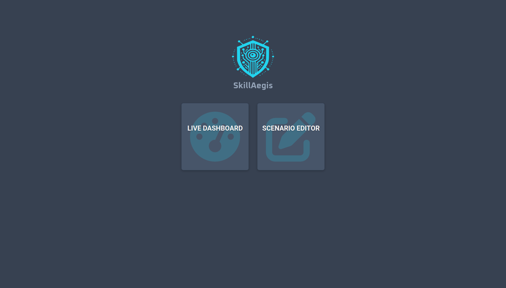
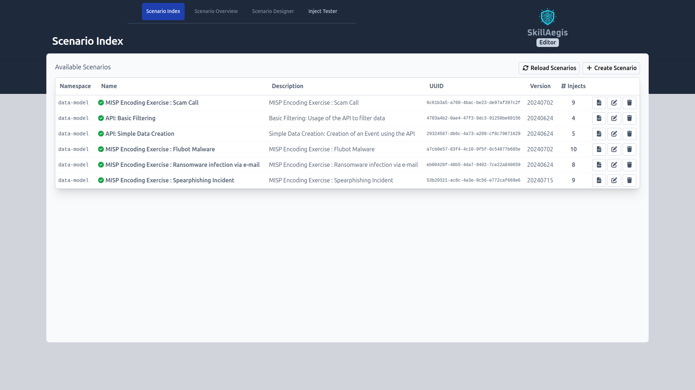
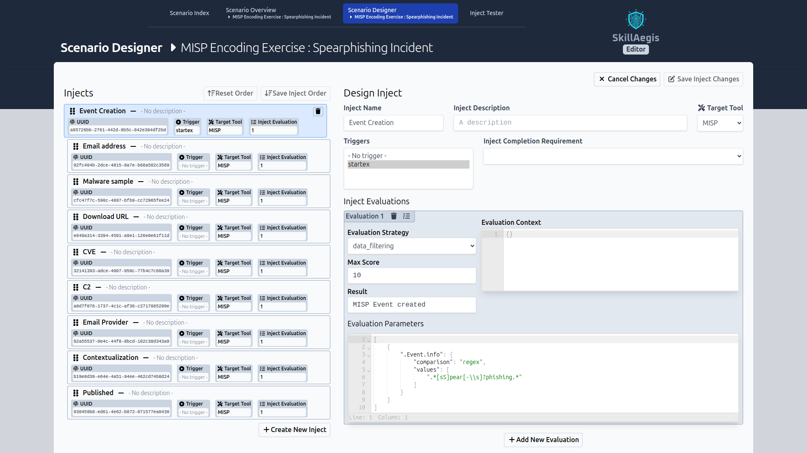

# SkillAegis
 

**SkillAegis** is a platform to design, run, and monitor exercise scenarios, enhancing skills in applications like MISP and training users in best practices for information management and protective tools. Its gamification system makes learning engaging, ensuring users acquire essential technical skills and adhere to industry standards.


## Features

- **Create Exercise Scenarios**: Design and customize various training exercises tailored to your needs.
- **Run Exercises**: Deploy scenarios and run training sessions.
- **Live Dashboard**: Monitor progress and performance with the live dashboard, providing realtime insights and analytics.

## Installation

To get started with SkillAegis, follow these steps:

0. Ensure Python **3.10** or higher is installed.
    ```bash
    python -V
    ```
1. Clone the repository:
    ```bash
    git clone https://github.com/MISP/SkillAegis.git
    ```
2. Navigate to the project directory:
    ```bash
    cd SkillAegis
    ```
3. Initialize the submodules
    ```bash
    git submodule update --init --recursive
    ```
4. Clone the configuration file
    ```bash
    cp config.json.sample config.json
    ```
    -   [optional] Update the configuration
5. Install the submodule dependencies
   ```bash
   # Editor
   pushd SkillAegis-Editor
   python3 -m venv venv
   source venv/bin/activate
   pip3 install -r requirements.txt
   cp config.py.sample config.py
   # [recommended] Update the configuration's MISP part
   deactivate
   popd

   # Dashboard
   pushd SkillAegis-Dashboard
   python3 -m venv venv
   source venv/bin/activate
   pip3 install -r requirements.txt
   cp config.py.sample config.py
   # [recommended] Update the configuration
   deactivate
   popd
   ```
6. Start the project
   ```bash
   bash SkillAegis.sh
   ```

## Update

To update the project, follow these steps:

1. Pull the latest changes
    ```bash
    git pull
    ```
2. Pull the latest changes for all submodules
    ```bash
    git submodule update --recursive
    ```

## Docker

You can alternatively run it in Docker, following those steps :

1. Build the image
    ```bash
    docker compose build
    ```
2. Copy and update the config
    ```bash
    cp template.env .env
    vim .env
    ```
3. [optional] Allow the application to reach services on the host
    ```bash
    # Create a docker override file and add the host as extra_hosts
    tee docker-compose.override.yml > /dev/null <<EOF
    services:
      skillaegis-dashboard:
        extra_hosts:
          - "host.docker.internal:host-gateway"
    EOF
    ```
    
4. Run the application
    ```bash
    docker compose up
    ```

# Project Structure

The project is composed of three applications:

1. **[SkillAegis](https://github.com/MISP/SkillAegis)**: The main application that configures and starts the two other projects. It also contains all created scenarios.
2. **[SkillAegis Editor](https://github.com/MISP/SkillAegis-Editor)**: The scenario builder to create new training exercises.
3. **[SkillAegis Dashboard](https://github.com/MISP/SkillAegis-Dashboard)**: The application to start training sessions and track participants' progress in real time.


## SkillAegis
SkillAegis is the primary application that configures, launches the two other projects, and houses the scenarios. While not essential for the overall project to function, it significantly simplifies the process.




## SkillAegis Editor
The **Editor** can be used to design or edit scenario.


*List of all available scenarios*


*While designing a scenario, you can create multiple injects, specify their execution order, outline any requirements for each, and define the criteria for evaluating and marking them as complete.*


*Writing evaluations for injects can be challenging, so the inject tester is provided to streamline this process.*

## SkillAegis Dashboard
The **Dashboard** can be used to run a training session and visualize the progress of participants in real-time.


*Short demo of SkillAegis-Dashboard: Once the application starts, the user selects an exercise. From that point, the application tracks the real-time progression of each players.*


*On the dashboard main page, you can monitor the progress of all participants for the selected exercise and view real-time logs of their activity feed.*


*The fullscreen view provides an overview of the status of all users in a single, easily accessible display.*


## Scenario format
The format used to describe the scenarios is the [Common Exercise Format (CEXF)](https://misp.github.io/cexf/).

The [format description](https://github.com/MISP/cexf/blob/main/format-description.md) outlines the JSON format including its overall structure and the semantics for each key. While scenarios can be written manually, we strongly recommend using the SkillAegis-Editor to simplify this process.

**Sample exercise**
```json
{
  "exercise": {
    "description": "Simple Spear Phishing e-mail example, mimicing a fraud case",
    "expanded": "# Simple Spear Phishing e-mail example, mimicing a fraud case",
    "meta": {
      "author": "MISP Project",
      "level": "beginner"
    },
    "name": "Phishing e-mail",
    "namespace": "phishing",
    "tags": [
      "exercise:software-scope=\"misp\"",
      "state:production"
    ],
    "total_duration": "7200",
    "uuid": "75d7460-af9d-4098-8ad1-754457076b32",
    "valid_until": "20310611",
    "version": "20210611"
  },
  "inject_flow": [...],
  "injects": [...],
}
```


## Contributing

We welcome contributions from the community. To contribute:

1. Fork the repository.
2. Create a new branch:
    ```bash
    git checkout -b feature/your-feature-name
    ```
3. Make your changes and commit them:
    ```bash
    git commit -m 'Add some feature'
    ```
4. Push to the branch:
    ```bash
    git push origin feature/your-feature-name
    ```
5. Open a pull request.

# License
This software is licensed under GNU Affero General Public License version 3

```
Copyright (c) 2024 Sami Mokaddem
Copyright (c) 2024 CIRCL - Computer Incident Response Center Luxembourg
```
