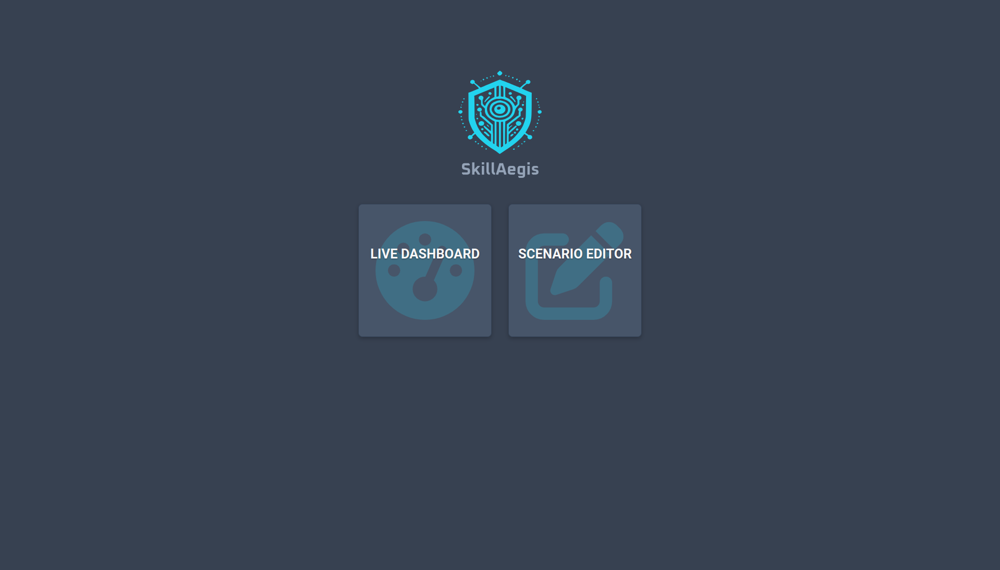
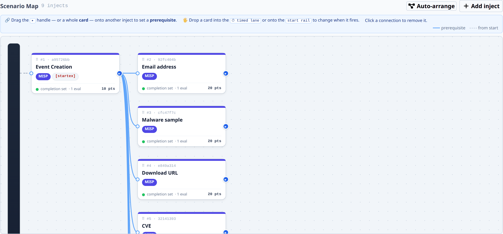
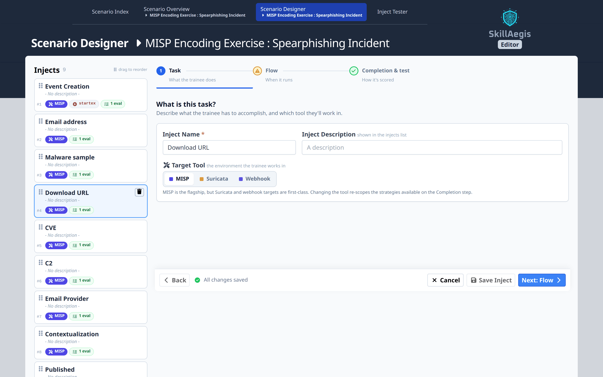
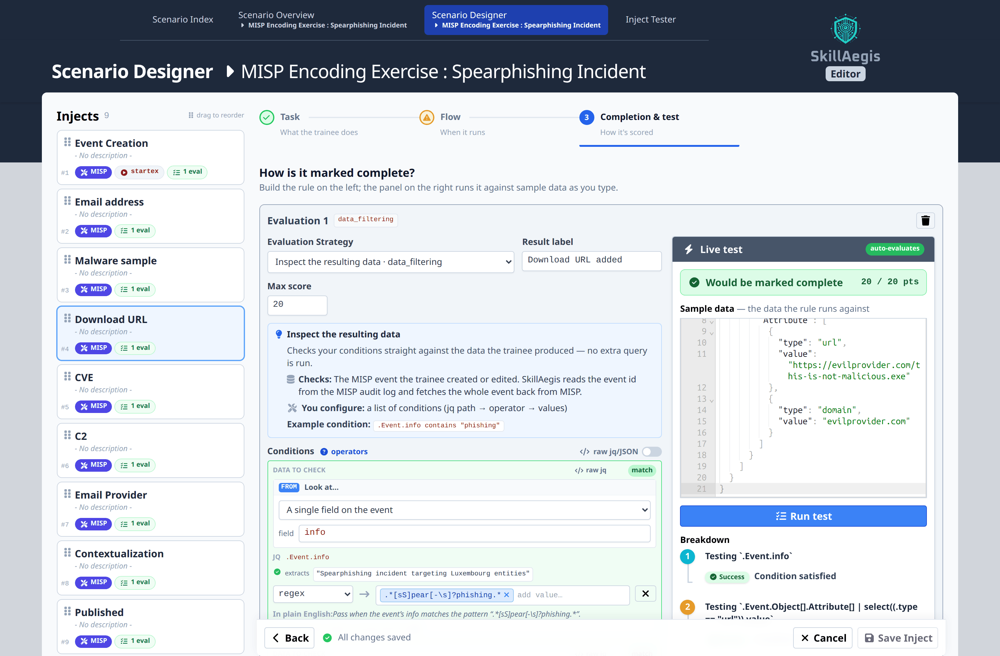
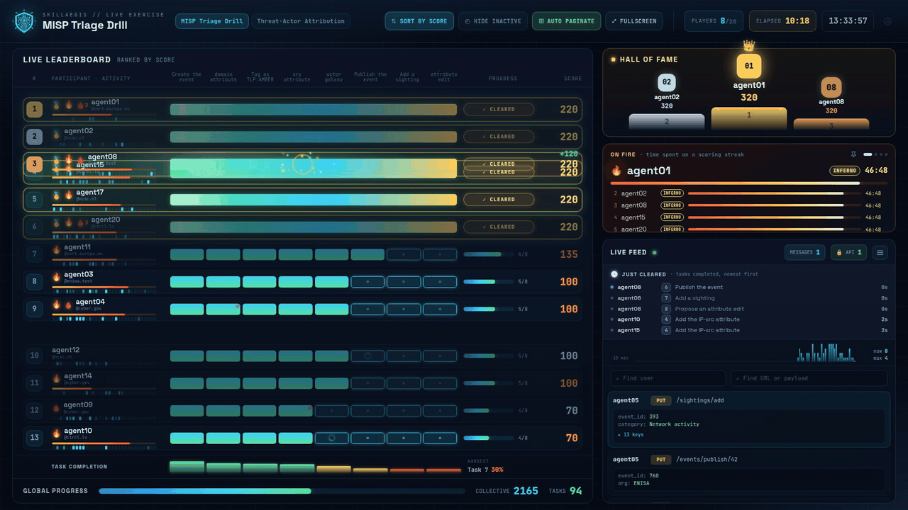
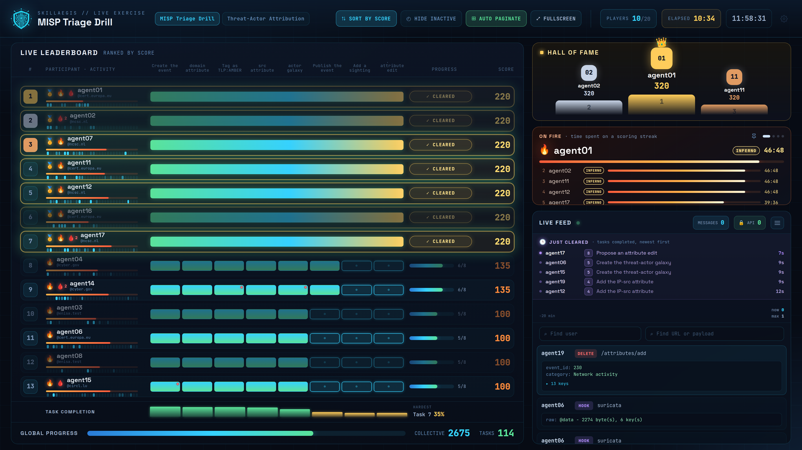
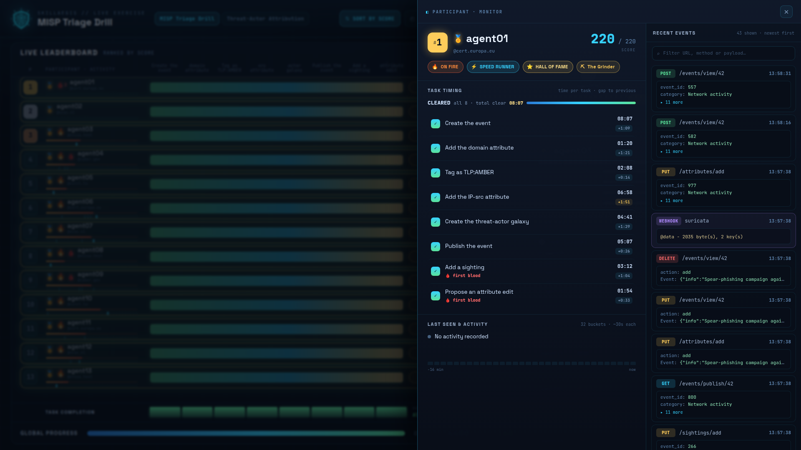
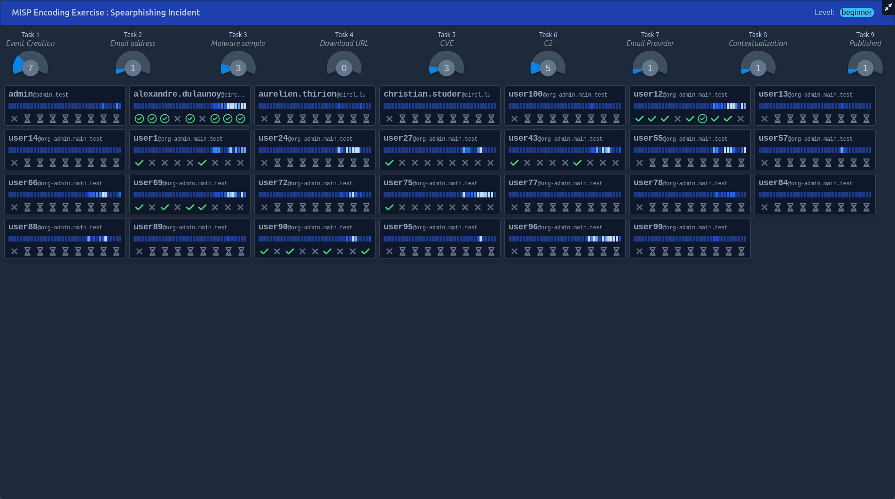

# SkillAegis
 

**SkillAegis** is a platform to design, run, and monitor exercise scenarios, enhancing skills in applications like MISP and training users in best practices for information management and protective tools. Its gamification system makes learning engaging, ensuring users acquire essential technical skills and adhere to industry standards.


## Features

- **Design exercise scenarios**: Build training exercises in the tool-agnostic [Common Exercise Format (CEXF)](https://misp.github.io/cexf/) with the **Editor** — a drag-driven scenario map, a guided inject designer, and a completion-rule builder with a live test.
- **Run training sessions**: Launch a scenario with the **Dashboard** and track every participant's progress in real time against MISP, Suricata, webhook and Python targets.
- **Live monitoring**: A real-time leaderboard, a streaming activity feed and a per-player drill-down give facilitators both an at-a-glance and an in-depth view of the session.
- **Gamification**: Scoring, trophies, "on fire" streaks and a Hall of Fame keep participants engaged, with a fullscreen big-screen view for the room.


## Local installation

To get started with SkillAegis, follow these steps:

0. Ensure Python **3.10** or higher is installed.
    ```bash
    python -V
    ```

1. Install dependencies
    ```bash
    sudo apt install screen jq git
    ```

2. Clone the repository:
    ```bash
    git clone https://github.com/MISP/SkillAegis.git
    ```

3. Navigate to the project directory:
    ```bash
    cd SkillAegis
    ```

4. Initialize the submodules
    ```bash
    git submodule update --init --recursive
    ```

5. Clone the configuration file
    ```bash
    cp config.json.sample config.json
    ```
    -   [optional] Update the configuration

6. Install the submodule dependencies
   ```bash
   # Editor
   pushd SkillAegis-Editor
   python3 -m venv venv
   source venv/bin/activate
   pip install -U setuptools pip
   pip install -r requirements.txt
   cp config.py.sample config.py
   # [recommended] Update the configuration's MISP part
   deactivate
   popd

   # Dashboard
   pushd SkillAegis-Dashboard
   python3 -m venv venv
   source venv/bin/activate
   pip install -U setuptools pip
   pip install -r backend/requirements.txt
   cp backend/config.py.sample backend/config.py
   # [recommended] Update the configuration's MISP connection and admin-panel credentials
   deactivate
   popd
   ```
   > The Dashboard reads its MISP connection (`misp_url`, `misp_apikey`, `misp_skipssl`) and
   > optional admin-panel credentials (`admin_email`, `admin_password`) from
   > `SkillAegis-Dashboard/backend/config.py`. If no admin credentials are set, a random
   > password is generated at startup and printed to the console / `SkillAegis.log`.

7. Start the project
   ```bash
   bash SkillAegis.sh
   ```


## Update local installation

To update the project, follow these steps:

1. Pull the latest changes in the main entry repository
    ```bash
    git pull
    ```

2. Pull the latest changes for all submodules
    ```bash
    git submodule update --recursive
    ```

3. Compare the current config with the sample config
   ```bash
   diff -u config.json.sample config.json
   ```

4. Update the submodule dependencies
   ```bash
   # Editor
   pushd SkillAegis-Editor
   source venv/bin/activate
   pip install -U setuptools pip
   pip install -U -r requirements.txt
   diff -u config.py.sample config.py
   deactivate
   popd

   # Dashboard
   pushd SkillAegis-Dashboard
   source venv/bin/activate
   pip install -U setuptools pip
   pip install -U -r backend/requirements.txt
   diff -u backend/config.py.sample backend/config.py
   deactivate
   popd
   ```


## Update issues

### No module named pip

If you get the error below you can simply recreate the venv with `python3 -m venv venv`.

```bash
$ pip install -U -r requirements.txt
Traceback (most recent call last):
  File "/home/steve/SkillAegis/SkillAegis-Editor/venv/bin/pip", line 5, in <module>
    from pip._internal.cli.main import main
ModuleNotFoundError: No module named 'pip'
```


## Docker

You can alternatively run it in Docker, following those steps :

0. Initialize the submodules
    ```bash
    git submodule update --init --recursive
    ```

1. Build the image
    ```bash
    # or use docker-compose
    docker compose build
    ```

2. Copy and update the config
    ```bash
    cp template.env .env
    vim .env
    ```

3. [optional] Allow the application to reach services on the host
    ```bash
    # Create a docker override file and add the host as extra_hosts
    tee docker-compose.override.yml > /dev/null <<EOF
    services:
      skillaegis-dashboard:
        extra_hosts:
          - "host.docker.internal:host-gateway"
    EOF
    ```

4. Run the application
```bash
    docker compose up
    ```


## Contributing

We welcome contributions from the community. To contribute:

1. Fork the repository.
2. Create a new branch:
    ```bash
    git checkout -b feature/your-feature-name
    ```
3. Make your changes and commit them:
    ```bash
    git commit -m 'new: Added fancy feature doing fancy things'
    ```
4. Push to the branch:
    ```bash
    git push origin feature/your-feature-name
    ```
5. Open a pull request.


## Development environment

If you want a development environment within the 'SkillAegis' entry repository you could do the following.

```bash
# Clone your SkillAegis fork and switch to the integration branch
git clone https://github.com/<fork_user>/SkillAegis.git
cd SkillAegis
git checkout develop
# Add the official remote for easy syncing
git remote add upstream https://github.com/MISP/SkillAegis.git

# Initialize submodules (will pull from upstream MISP repos)
git submodule update --init --recursive

# Now reconfigure submodules to point to YOUR forks
cd SkillAegis-Editor
git remote set-url origin https://github.com/<fork_user>/SkillAegis-Editor.git
git remote add upstream https://github.com/MISP/SkillAegis-Editor.git
cd ..

cd SkillAegis-Dashboard
git remote set-url origin https://github.com/<fork_user>/SkillAegis-Dashboard.git
git remote add upstream https://github.com/MISP/SkillAegis-Dashboard.git
cd ..

# `submodule update` leaves each submodule in a detached HEAD at the pinned
# commit — switch them onto a branch before committing any work in them.
git submodule foreach 'git checkout develop'
```

This should allow you to easily work on all 3 repositories for your development environment.
Keep the three repos in sync by syncing each from its `upstream` remote (`git fetch upstream && git merge upstream/develop`).

# Project Structure

The project is composed of three applications:

1. **[SkillAegis](https://github.com/MISP/SkillAegis)**: The main application that configures and starts the two other projects. It also contains all created scenarios.
2. **[SkillAegis Editor](https://github.com/MISP/SkillAegis-Editor)**: The scenario builder to create new training exercises.
3. **[SkillAegis Dashboard](https://github.com/MISP/SkillAegis-Dashboard)**: The application to start training sessions and track participants' progress in real time.


## SkillAegis
SkillAegis is the primary application that configures, launches the two other projects, and houses the scenarios. While not essential for the overall project to function, it significantly simplifies the process.




## SkillAegis Editor
The **Editor** is used to design and edit scenarios. A scenario is a set of **injects** (tasks a
trainee performs in a target tool) plus a parallel **flow** describing when each fires, what it
depends on, and how it is scored. Authoring stays **tool-agnostic** — MISP, Suricata, webhook and
Python targets are all first-class.


*List of all available scenarios, with their CEXF validity, target namespace and inject count.*


*The Scenario Map is a drag-driven overview of the whole exercise: injects are laid out by dependency depth, and you wire up the flow by direct manipulation — drop a card onto another to set a prerequisite, or onto the start rail / timed lane to change when it fires.*


*Each inject is edited through a focused Task → Flow → Completion stepper — separating what the trainee does, when it runs, and how it is scored.*


*Writing evaluations used to be the hardest part of authoring. Build a completion rule as `field → operator → values` rows (or with the `FROM / WHERE / CHECK` query builder), and the panel on the right re-runs it against sample data as you type — showing a pass/fail verdict and per-condition breakdown without leaving the page.*


## SkillAegis Dashboard
The **Dashboard** is used to run a training session and visualize the progress of participants in
real-time. It offers:

- **Real-time leaderboard** — ranks every participant live with per-task progress and scores, plus a task-completion chart that flags the hardest task.
- **Live activity feed** — a streaming log of participant activity (MISP events, webhooks and tool calls) with verbose / API-only filters and per-user or per-target search.
- **Player drill-down** — click any participant for a detailed view of their task-by-task timing, activity timeline and searchable event history.
- **Gamification** — scoring, trophies, "on fire" streaks, a Hall of Fame podium and celebratory all-clear bursts keep sessions engaging.
- **Presentation & operations** — a fullscreen big-screen overview, a live-connection health indicator (LIVE / NO LIVE DATA / OFFLINE), an authenticated admin panel and a reduce-motion accessibility toggle.


*Short demo of SkillAegis-Dashboard: once the application starts, the user selects an exercise. From that point, the application tracks the real-time progression of each player.*


*On the dashboard main page, you can monitor the progress of all participants for the selected exercise and view real-time logs of their activity feed.*


*Click any participant to open their drill-down: task-by-task timing, badges and scoring streaks, and a searchable history of their events, webhooks and tool calls.*


*The fullscreen view provides an overview of the status of all users in a single, easily accessible display.*


## Bundled scenarios
A set of ready-to-run scenarios ships in the [`scenarios/`](./scenarios) folder. Point the Editor or
Dashboard at that folder (the default) to open, run or use them as a starting point for your own.

| Scenario | Level | Focus |
|---|---|---|
| API: Simple Data Creation | beginner | Create a MISP event through the API |
| API: Basic Filtering | beginner | Filter MISP data through the API |
| MISP Encoding Exercise: Scam Call | beginner | Encode a scam-call incident in MISP |
| MISP Encoding Exercise: Spearphishing Incident | beginner | Encode a spearphishing incident in MISP |
| MISP Encoding Exercise: Flubot Malware | beginner | Encode the Flubot malware case using the MISP data model |
| MISP Encoding Exercise: Ransomware infection via e-mail | advanced | Encode a ransomware-via-email incident in MISP |
| Campaign Targeting Multiple ISACs | advanced | Model a campaign spanning several ISACs in MISP |
| Protect the network! | advanced | Turn IoCs into Suricata protection rules |
| SOC Analysis Workshop | advanced | Investigate PCAPs, correlate, and feed protective tools (NGSOTI) |
| Hack.lu Workflow Exercises | advanced | Learn to build MISP workflows |
| Workflow Exercise | expert | Advanced MISP workflow authoring |


## Scenario format
The format used to describe the scenarios is the [Common Exercise Format (CEXF)](https://misp.github.io/cexf/).

The [format description](https://github.com/MISP/cexf/blob/main/format-description.md) outlines the JSON format including its overall structure and the semantics for each key. While scenarios can be written manually, we strongly recommend using the SkillAegis-Editor to simplify this process.

**Sample exercise**
```json
{
  "exercise": {
    "description": "Simple Spear Phishing e-mail example, mimicing a fraud case",
    "expanded": "# Simple Spear Phishing e-mail example, mimicing a fraud case",
    "meta": {
      "author": "MISP Project",
      "level": "beginner"
    },
    "name": "Phishing e-mail",
    "namespace": "phishing",
    "tags": [
      "exercise:software-scope=\"misp\"",
      "state:production"
    ],
    "total_duration": "7200",
    "uuid": "75d7460-af9d-4098-8ad1-754457076b32",
    "valid_until": "20310611",
    "version": "20210611"
  },
  "inject_flow": [...],
  "injects": [...],
}
```

# License
This software is licensed under GNU Affero General Public License version 3

```
Copyright (c) 2025 Steve Clement
Copyright (c) 2024-2025 Sami Mokaddem
Copyright (c) 2024 CIRCL - Computer Incident Response Center Luxembourg
```
